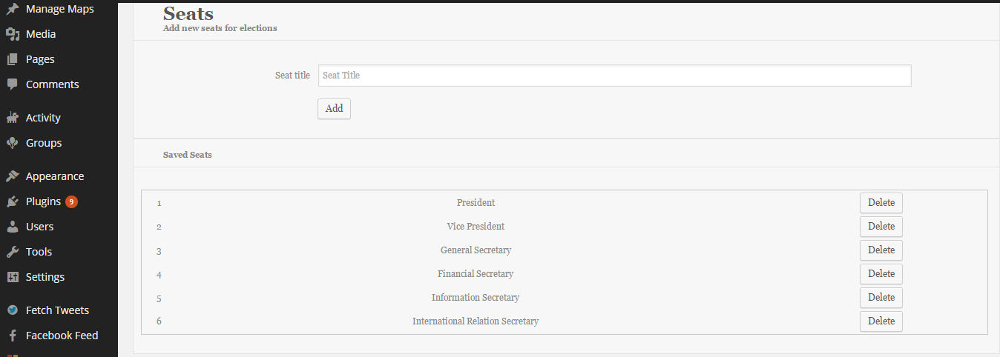
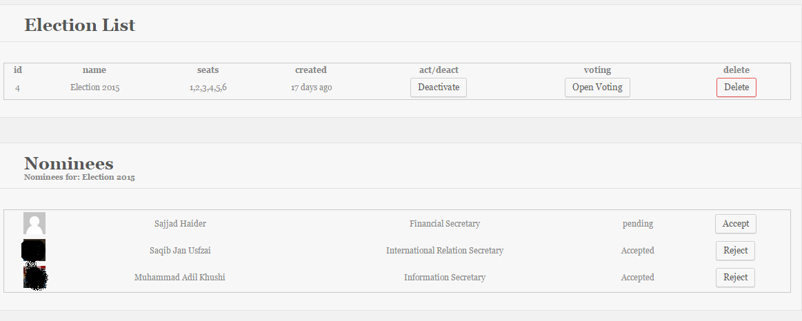
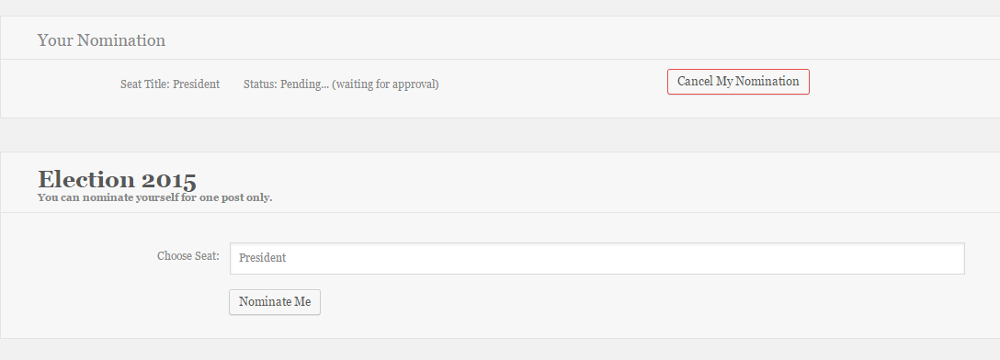
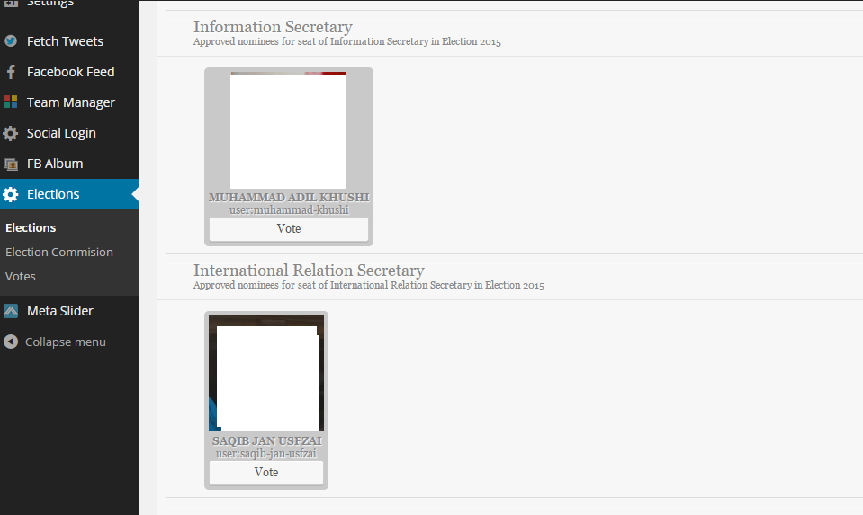
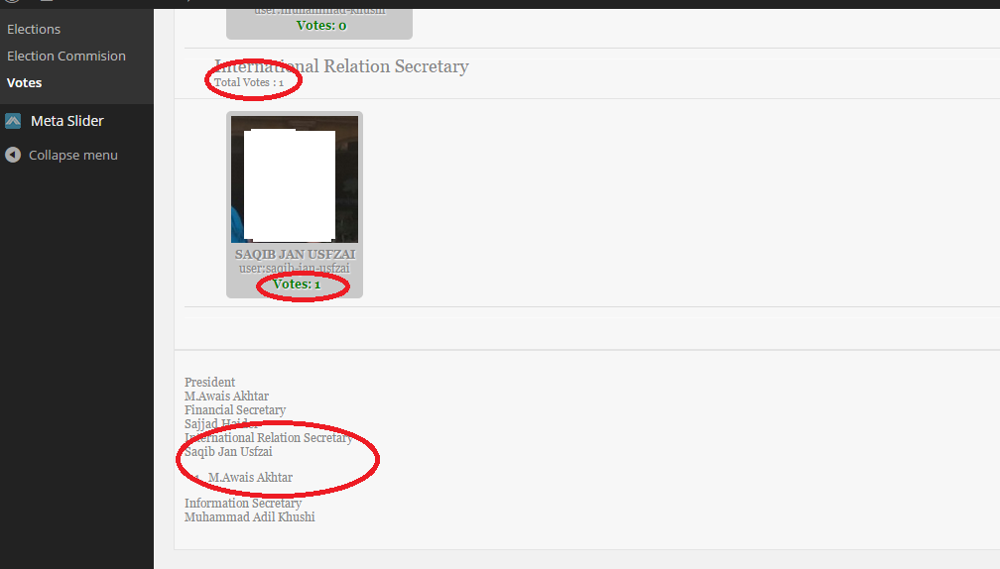

VanillaElection
===============

Election plugin for PSA-Kiel

Paste it in plugin folder and activate just like normal plugin

!Changing structure(fix DAL), shift to ActiveRecord in develop branch.

Comes with no gaurantee:

Screens:

